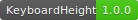

[](https://bintray.com/beta/#/iamthevoid/maven/KeyboardHeight)          

Android Sdk ≥ 14

# KeyboardHeight
###### simple library for observe keyboard pixel height (callback, coroutines or rx way) before Android API 30


## Usage

### Rx

```kotlin 
KeyboardHeight.observeKeyboardHeight(this /* activity */ )  
        .observeOn(AndroidSchedulers.mainThread())  
        .subscribe( { parameters ->  } ) 
 ``` 
 ### Coroutines
 ```kotlin 
 KeyboardHeight.observeKeyboardHeight(this)  
        .collect(object : FlowCollector<Parameters> {  
            override suspend fun emit(value: Parameters) {  
                // on keyboard changed   
            }  
        })
``` 

### Callback

```kotlin 
KeyboardHeight(this /* activity */ , object : KeyboardListener {  
    override fun onKeyboardChanged(parameters: Parameters) {  
        // on keyboard changed  
  }  
})
 ``` 
## Parameters

`Parameters` is collection of keyboard-around parameters

```kotlin 
data class Parameters(val keyboardHeightPixels : Int, val screenOrientation : Int) {  
  
    @get:JvmName("isPortrait")  
    val isPortrait  
        get() = screenOrientation == Configuration.ORIENTATION_PORTRAIT  
  
    @get:JvmName("isKeyboardOnScreen")  
    val isKeyboardOnScreen  
        get() = keyboardHeightPixels > 0  
}
 ``` 

 ## Adding to project Add repository:   
```groovy 
maven { url "https://dl.bintray.com/iamthevoid/maven/" } 
``` 
RxJava 1
 ```groovy 
 implementation "iam.thevoid.keyboard.height:rx1:1.0.0"  
 ``` 
 RxJava 2
 ```groovy 
 implementation "iam.thevoid.keyboard.height:rx2:1.0.0"  
 ``` 
 RxJava 3
 ```groovy 
 implementation "iam.thevoid.keyboard.height:rx3:1.0.0"  
 ```
 Coroutines 
 ```groovy 
 implementation "iam.thevoid.keyboard.height:coroutines:1.0.0"  
 ```
 Raw with callback
 ```groovy 
 implementation "iam.thevoid.keyboard.height:callback:1.0.0"  
 ```
